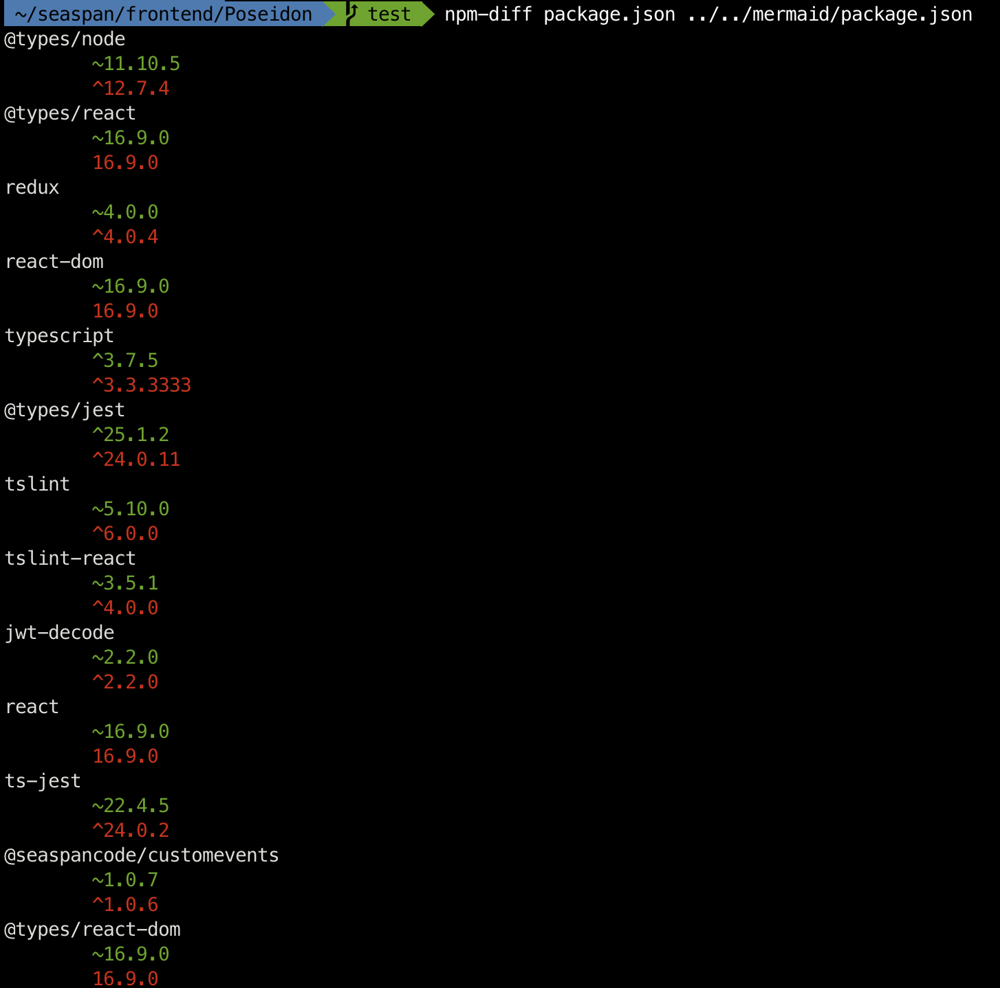

## NPM Diff

> displays dependency differences between two npm package.json files

### Install

`go get github.com/berto/npm-diff`

## Usage

`npm-diff [path-to-package-json] [path-to-other-package-json]`

## Example

